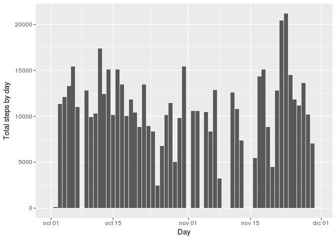
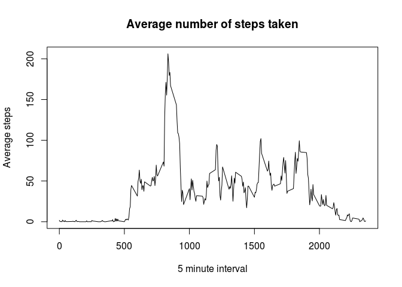
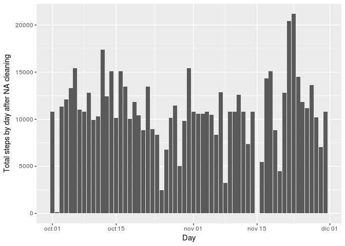
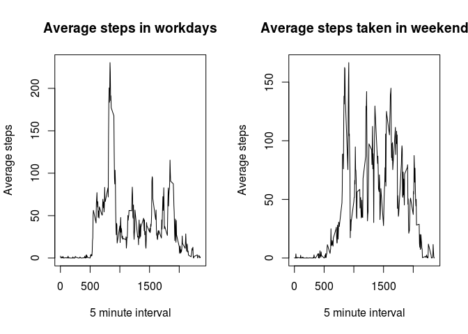

# Reproducible Research: Peer Assessment 1
Marcela Castro León  
April 1, 2017  

#Course Reproducible Research - R Markdown project 

##1) Code for reading in the dataset and/or processing the data

```r
library(dplyr)
```

```
## 
## Attaching package: 'dplyr'
```

```
## The following objects are masked from 'package:stats':
## 
##     filter, lag
```

```
## The following objects are masked from 'package:base':
## 
##     intersect, setdiff, setequal, union
```

```r
library(ggplot2)
setwd("~/MEGAsync/DATA-SCIENCE/work/c5-w2-project")
activity <- read.csv("activity.csv")
activitydt<-tbl_df(activity)
```


##2) Histogram of the total number of steps taken each day

```r
stepbydate<-activitydt %>% group_by(date) %>% summarise(totalbyday=sum(steps,na.rm = TRUE)) 
stepbydate$date<-as.Date(stepbydate$date,"%Y-%m-%d")
ggplot(data = stepbydate, aes(date, totalbyday))+stat_summary(fun.y = sum,geom = "bar") +xlab("Day") + ylab("Total steps by day")
```

<!-- -->

##3) Mean and median number of steps taken each day


```r
meanstepbydate<-activitydt %>% group_by(interval) %>% summarise(mean=mean(steps,na.rm=TRUE))
medianstepbydate<-activitydt %>% group_by(interval) %>% summarise(median=median(steps,na.rm=TRUE))
cbind(meanstepbydate, median=medianstepbydate$median)
```

```
##     interval        mean median
## 1          0   1.7169811      0
## 2          5   0.3396226      0
## 3         10   0.1320755      0
## 4         15   0.1509434      0
## 5         20   0.0754717      0
## 6         25   2.0943396      0
## 7         30   0.5283019      0
## 8         35   0.8679245      0
## 9         40   0.0000000      0
## 10        45   1.4716981      0
## 11        50   0.3018868      0
## 12        55   0.1320755      0
## 13       100   0.3207547      0
## 14       105   0.6792453      0
## 15       110   0.1509434      0
## 16       115   0.3396226      0
## 17       120   0.0000000      0
## 18       125   1.1132075      0
## 19       130   1.8301887      0
## 20       135   0.1698113      0
## 21       140   0.1698113      0
## 22       145   0.3773585      0
## 23       150   0.2641509      0
## 24       155   0.0000000      0
## 25       200   0.0000000      0
## 26       205   0.0000000      0
## 27       210   1.1320755      0
## 28       215   0.0000000      0
## 29       220   0.0000000      0
## 30       225   0.1320755      0
## 31       230   0.0000000      0
## 32       235   0.2264151      0
## 33       240   0.0000000      0
## 34       245   0.0000000      0
## 35       250   1.5471698      0
## 36       255   0.9433962      0
## 37       300   0.0000000      0
## 38       305   0.0000000      0
## 39       310   0.0000000      0
## 40       315   0.0000000      0
## 41       320   0.2075472      0
## 42       325   0.6226415      0
## 43       330   1.6226415      0
## 44       335   0.5849057      0
## 45       340   0.4905660      0
## 46       345   0.0754717      0
## 47       350   0.0000000      0
## 48       355   0.0000000      0
## 49       400   1.1886792      0
## 50       405   0.9433962      0
## 51       410   2.5660377      0
## 52       415   0.0000000      0
## 53       420   0.3396226      0
## 54       425   0.3584906      0
## 55       430   4.1132075      0
## 56       435   0.6603774      0
## 57       440   3.4905660      0
## 58       445   0.8301887      0
## 59       450   3.1132075      0
## 60       455   1.1132075      0
## 61       500   0.0000000      0
## 62       505   1.5660377      0
## 63       510   3.0000000      0
## 64       515   2.2452830      0
## 65       520   3.3207547      0
## 66       525   2.9622642      0
## 67       530   2.0943396      0
## 68       535   6.0566038      0
## 69       540  16.0188679      0
## 70       545  18.3396226      0
## 71       550  39.4528302      0
## 72       555  44.4905660      0
## 73       600  31.4905660      0
## 74       605  49.2641509      0
## 75       610  53.7735849      0
## 76       615  63.4528302      0
## 77       620  49.9622642      0
## 78       625  47.0754717      0
## 79       630  52.1509434      0
## 80       635  39.3396226      0
## 81       640  44.0188679      0
## 82       645  44.1698113      0
## 83       650  37.3584906      8
## 84       655  49.0377358     13
## 85       700  43.8113208      7
## 86       705  44.3773585     13
## 87       710  50.5094340     14
## 88       715  54.5094340      0
## 89       720  49.9245283      0
## 90       725  50.9811321     12
## 91       730  55.6792453      0
## 92       735  44.3207547      0
## 93       740  52.2641509     15
## 94       745  69.5471698     19
## 95       750  57.8490566     19
## 96       755  56.1509434     28
## 97       800  73.3773585     41
## 98       805  68.2075472     25
## 99       810 129.4339623     32
## 100      815 157.5283019     13
## 101      820 171.1509434     45
## 102      825 155.3962264     33
## 103      830 177.3018868     37
## 104      835 206.1698113     19
## 105      840 195.9245283     51
## 106      845 179.5660377     60
## 107      850 183.3962264     16
## 108      855 167.0188679     43
## 109      900 143.4528302     20
## 110      905 124.0377358      8
## 111      910 109.1132075     31
## 112      915 108.1132075     15
## 113      920 103.7169811     16
## 114      925  95.9622642      0
## 115      930  66.2075472      0
## 116      935  45.2264151      0
## 117      940  24.7924528      0
## 118      945  38.7547170      0
## 119      950  34.9811321      0
## 120      955  21.0566038      0
## 121     1000  40.5660377      0
## 122     1005  26.9811321      0
## 123     1010  42.4150943      0
## 124     1015  52.6603774      0
## 125     1020  38.9245283      0
## 126     1025  50.7924528      0
## 127     1030  44.2830189      0
## 128     1035  37.4150943      0
## 129     1040  34.6981132      0
## 130     1045  28.3396226      0
## 131     1050  25.0943396      0
## 132     1055  31.9433962      0
## 133     1100  31.3584906      0
## 134     1105  29.6792453      0
## 135     1110  21.3207547      0
## 136     1115  25.5471698      0
## 137     1120  28.3773585      0
## 138     1125  26.4716981      0
## 139     1130  33.4339623      0
## 140     1135  49.9811321      0
## 141     1140  42.0377358      0
## 142     1145  44.6037736      0
## 143     1150  46.0377358      0
## 144     1155  59.1886792      0
## 145     1200  63.8679245      0
## 146     1205  87.6981132      0
## 147     1210  94.8490566      6
## 148     1215  92.7735849     10
## 149     1220  63.3962264      0
## 150     1225  50.1698113      0
## 151     1230  54.4716981      0
## 152     1235  32.4150943      0
## 153     1240  26.5283019      0
## 154     1245  37.7358491      0
## 155     1250  45.0566038      0
## 156     1255  67.2830189      0
## 157     1300  42.3396226      0
## 158     1305  39.8867925      0
## 159     1310  43.2641509      0
## 160     1315  40.9811321      0
## 161     1320  46.2452830      0
## 162     1325  56.4339623      0
## 163     1330  42.7547170      0
## 164     1335  25.1320755      0
## 165     1340  39.9622642      0
## 166     1345  53.5471698      0
## 167     1350  47.3207547      0
## 168     1355  60.8113208      0
## 169     1400  55.7547170      0
## 170     1405  51.9622642      0
## 171     1410  43.5849057      0
## 172     1415  48.6981132      0
## 173     1420  35.4716981      0
## 174     1425  37.5471698      0
## 175     1430  41.8490566      0
## 176     1435  27.5094340      0
## 177     1440  17.1132075      0
## 178     1445  26.0754717      0
## 179     1450  43.6226415      0
## 180     1455  43.7735849      0
## 181     1500  30.0188679      0
## 182     1505  36.0754717      0
## 183     1510  35.4905660      0
## 184     1515  38.8490566      0
## 185     1520  45.9622642      0
## 186     1525  47.7547170      0
## 187     1530  48.1320755      0
## 188     1535  65.3207547      0
## 189     1540  82.9056604      0
## 190     1545  98.6603774      0
## 191     1550 102.1132075      0
## 192     1555  83.9622642      0
## 193     1600  62.1320755      0
## 194     1605  64.1320755      0
## 195     1610  74.5471698      0
## 196     1615  63.1698113      0
## 197     1620  56.9056604      0
## 198     1625  59.7735849      0
## 199     1630  43.8679245      0
## 200     1635  38.5660377      0
## 201     1640  44.6603774      0
## 202     1645  45.4528302      0
## 203     1650  46.2075472      0
## 204     1655  43.6792453      0
## 205     1700  46.6226415      0
## 206     1705  56.3018868      0
## 207     1710  50.7169811      0
## 208     1715  61.2264151      7
## 209     1720  72.7169811      7
## 210     1725  78.9433962      0
## 211     1730  68.9433962      7
## 212     1735  59.6603774      7
## 213     1740  75.0943396     26
## 214     1745  56.5094340      7
## 215     1750  34.7735849      0
## 216     1755  37.4528302     10
## 217     1800  40.6792453     15
## 218     1805  58.0188679     18
## 219     1810  74.6981132     26
## 220     1815  85.3207547     25
## 221     1820  59.2641509     24
## 222     1825  67.7735849      9
## 223     1830  77.6981132     33
## 224     1835  74.2452830     26
## 225     1840  85.3396226     34
## 226     1845  99.4528302     42
## 227     1850  86.5849057     33
## 228     1855  85.6037736     30
## 229     1900  84.8679245     33
## 230     1905  77.8301887     30
## 231     1910  58.0377358      8
## 232     1915  53.3584906      8
## 233     1920  36.3207547      7
## 234     1925  20.7169811      0
## 235     1930  27.3962264      0
## 236     1935  40.0188679      0
## 237     1940  30.2075472      0
## 238     1945  25.5471698      0
## 239     1950  45.6603774      0
## 240     1955  33.5283019      0
## 241     2000  19.6226415      0
## 242     2005  19.0188679      0
## 243     2010  19.3396226      0
## 244     2015  33.3396226      0
## 245     2020  26.8113208      0
## 246     2025  21.1698113      0
## 247     2030  27.3018868      0
## 248     2035  21.3396226      0
## 249     2040  19.5471698      0
## 250     2045  21.3207547      0
## 251     2050  32.3018868      0
## 252     2055  20.1509434      0
## 253     2100  15.9433962      0
## 254     2105  17.2264151      0
## 255     2110  23.4528302      0
## 256     2115  19.2452830      0
## 257     2120  12.4528302      0
## 258     2125   8.0188679      0
## 259     2130  14.6603774      0
## 260     2135  16.3018868      0
## 261     2140   8.6792453      0
## 262     2145   7.7924528      0
## 263     2150   8.1320755      0
## 264     2155   2.6226415      0
## 265     2200   1.4528302      0
## 266     2205   3.6792453      0
## 267     2210   4.8113208      0
## 268     2215   8.5094340      0
## 269     2220   7.0754717      0
## 270     2225   8.6981132      0
## 271     2230   9.7547170      0
## 272     2235   2.2075472      0
## 273     2240   0.3207547      0
## 274     2245   0.1132075      0
## 275     2250   1.6037736      0
## 276     2255   4.6037736      0
## 277     2300   3.3018868      0
## 278     2305   2.8490566      0
## 279     2310   0.0000000      0
## 280     2315   0.8301887      0
## 281     2320   0.9622642      0
## 282     2325   1.5849057      0
## 283     2330   2.6037736      0
## 284     2335   4.6981132      0
## 285     2340   3.3018868      0
## 286     2345   0.6415094      0
## 287     2350   0.2264151      0
## 288     2355   1.0754717      0
```

```r
mean(stepbydate$totalbyday)
```

```
## [1] 9354.23
```

```r
median(stepbydate$totalbyday)
```

```
## [1] 10395
```

##4) Time series plot of the average number of steps taken


```r
stepbyinterval <- activitydt %>% group_by(interval) %>% summarise(avgbyinterval=mean(steps,na.rm=TRUE))
plot(stepbyinterval$interval,stepbyinterval$avgbyinterval,type="l", main="Average number of steps taken", xlab="5 minute interval", ylab="Average steps")
```

<!-- -->

##5) The 5-minute interval that, on average, contains the maximum number of steps

```r
filter(stepbyinterval, avgbyinterval==max(stepbyinterval$avgbyinterval))
```

```
## # A tibble: 1 × 2
##   interval avgbyinterval
##      <int>         <dbl>
## 1      835      206.1698
```

##6)Code to describe and show a strategy for imputing missing data

The mean of the interval in assigned for NA measures

```r
for (i in 1:nrow(activitydt)) {
    rowact <- activitydt[i,]
    meaninterval<-filter(stepbyinterval,interval==rowact$interval) 
    if(is.na(activitydt[i,]$steps)) {
      activitydt[i,]$steps<-meaninterval$avgbyinterval
    }
}
```

##7) Histogram of the total number of steps taken each day after missing values are imputed


```r
stepbydate2<-activitydt %>% group_by(date) %>% summarise(totalbyday=sum(steps)) 
stepbydate2$date<-as.Date(stepbydate2$date,"%Y-%m-%d")
ggplot(data = stepbydate2, aes(date, totalbyday))+stat_summary(fun.y = sum,geom = "bar") +xlab("Day") + ylab("Total steps by day after NA cleaning")
```

<!-- -->

Mean and Median after removing NA value have increased

```r
mean(stepbydate2$totalbyday)
```

```
## [1] 10766.19
```

```r
median(stepbydate2$totalbyday)
```

```
## [1] 10766.19
```

##8) Panel plot comparing the average number of steps taken per 5-minute interval across weekdays and weekends

```r
library(chron)
activitydt$date<-as.Date(activitydt$date,"%Y-%m-%d")
activitydt <-mutate(activitydt,wend=is.weekend(activitydt$date))
activitydtnowend <-filter(activitydt,!wend)
activitydtwend <-filter(activitydt,wend)
stepbyintervalnowend <- activitydtnowend %>% group_by(interval) %>% summarise(avgbyinterval=mean(steps,na.rm=TRUE))
stepbyintervalwend <- activitydtwend %>% group_by(interval) %>% summarise(avgbyinterval=mean(steps,na.rm=TRUE))
par(mfrow=c(1,2))
plot(stepbyintervalnowend$interval,stepbyintervalnowend$avgbyinterval,type="l", main="Average steps in workdays", xlab="5 minute interval", ylab="Average steps")
plot(stepbyintervalwend$interval,stepbyintervalwend$avgbyinterval,type="l", main="Average steps taken in weekend", xlab="5 minute interval", ylab="Average steps")
```

<!-- -->
